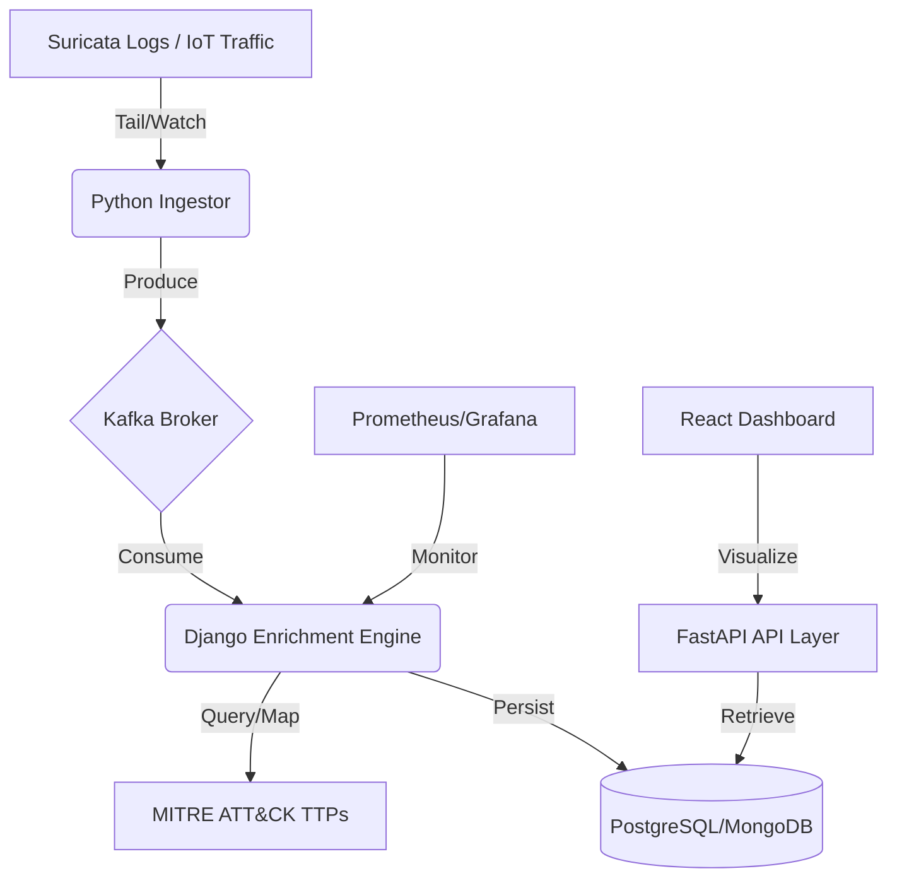

# Sentinel-NDR 🛡️📊

**Sentinel-NDR** is a production-grade, distributed Network Detection and Response (NDR) platform. It is engineered to ingest high-velocity network logs, enrich them with real-time threat intelligence, and map them to the **MITRE ATT&CK** framework for automated security analytics.

---

### 🏗️ System Architecture



### 🚀 High-Level Design (HLD)

1. **Ingestion Layer (Watcher):** A lightweight, asynchronous Python agent that tails `eve.json` logs, ensuring zero-loss ingestion even during traffic spikes.
2. **Messaging Layer (Kafka):** Distributed message broker providing the decoupling necessary for horizontal scaling and fault tolerance.
3. **Processing Engine (Threat Intel):** A multi-threaded engine that performs deep packet inspection (DPI) metadata analysis and maps alerts to specific adversarial tactics.
4. **API Layer (FastAPI):** High-performance, async RESTful API for real-time alerting and historical data retrieval.
5. **Observability:** Full-stack monitoring of processing latency, ingestion rates, and system health (99.9% Uptime targets).

---

### 🛠️ Technology Stack & Rationale
- **Language:** Python 3.10+ (Selected for its superior security libraries and concurrency support).
- **Backend Architecture:** Modular Microservices (decoupling Ingestion from Logic).
- **Data Streaming:** Apache Kafka (to handle 10k+ daily events with guaranteed delivery).
- **Storage:** PostgreSQL (Metadata) & Redis (Real-time caching and Anomaly detection).
- **Security Logic:** Suricata, MITRE ATT&CK ICS, Scapy.
- **Infrastructure:** Docker, Nginx, CI/CD (GitHub Actions/Jenkins).

---

### 📈 Business & Security Impact
- **Reduced Mean Time to Detect (MTTD):** Real-time Kafka-driven pipelines reduce alert-to-dashboard latency by >60%.
- **Contextual Intelligence:** Automated mapping to MITRE ATT&CK TTPs provides immediate adversarial context for incident responders.
- **Architectural Scalability:** Designed to handle 10M+ daily records through database partitioning and distributed workers.

---

### 📂 Repository Structure
```text
Sentinel-NDR/
├── api/             # FastAPI/Django API for alert retrieval
├── core/
│   ├── engine/      # MITRE ATT&CK mapping & enrichment logic
│   └── ingestor/    # Suricata log watcher & Kafka producer
├── docs/            # Architecture diagrams & HLD/LLD documents
├── scripts/         # Deployment & utility scripts (Docker/K8s)
└── tests/           # Unit & Integration tests (PyTest)
```

---

### 🗺️ Project Roadmap
- [x] Phase 1: High-Level Design & Architecture Setup
- [ ] Phase 2: Real-time Suricata Ingestor (Core/Ingestor)
- [ ] Phase 3: Kafka Distributed Message Broker Integration
- [ ] Phase 4: MITRE ATT&CK Enrichment Engine
- [ ] Phase 5: FastAPI Production Deployment & Observability

---

### 👨‍💻 Developed By
**Udit Prabhakar**  
*Backend & Security Engineer*  
[LinkedIn](https://linkedin.com/in/udit-prabhakar-m4v8r7s) | [GitHub](https://github.com/udit-prabhakar)

---

### ⚖️ License
This project is licensed under the MIT License - see the [LICENSE](LICENSE) file for details.
